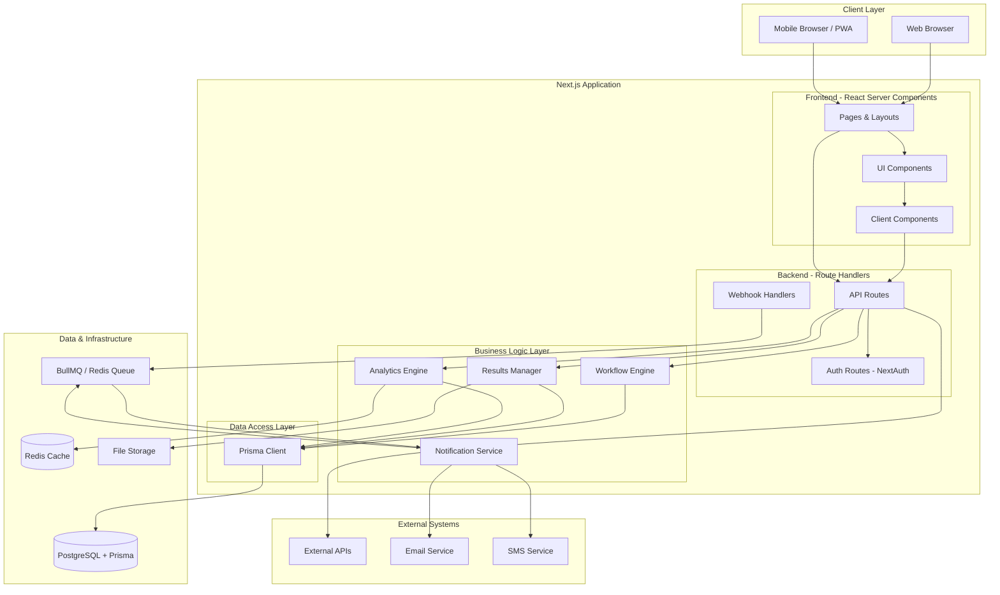

# Gobii Results Manager - Resumo de Arquitetura

**Documento para:** Lead Operations Manager  
**Data:** 27 de Janeiro de 2026  
**Versão:** 1.1

---

## Resumo Executivo da Arquitetura (10-12 Bullets)

1. **Arquitetura Full-Stack com Next.js**: Sistema construído sobre Next.js 14+ App Router, unificando frontend React e backend API (Route Handlers) numa única aplicação coesa, simplificando deployment e reduzindo complexidade operacional.

2. **Frontend Modular com React Server Components**: Interface de utilizador aproveitando React Server Components para rendering otimizado, componentes reutilizáveis, state management centralizado (Zustand/Context API), e design system consistente em todos os módulos (workflows, resultados, analytics).

3. **Backend API com Next.js Route Handlers**: APIs RESTful implementadas através de Route Handlers do Next.js App Router, proporcionando endpoints type-safe, middleware integrado, e co-localização de lógica de negócio com rotas, mantendo separação clara de responsabilidades.

4. **PostgreSQL como Base de Dados Única**: Solução de dados centralizada em PostgreSQL para todos os tipos de informação - dados transacionais (workflows, utilizadores, permissões), resultados de processos, logs de auditoria, e métricas analíticas - garantindo consistência ACID e simplificando gestão de dados.

5. **Prisma ORM para Gestão de Dados**: Utilização de Prisma como ORM type-safe com schema declarativo, migrations versionadas, query builder intuitivo, e geração automática de tipos TypeScript, assegurando integridade de dados e developer experience superior.

6. **Workflow Engine Configurável**: Motor de workflows baseado em state machines (usando biblioteca como XState ou implementação custom), permitindo definição, execução e monitorização de processos de negócio complexos com suporte a paralelização, condicionais e rollback, persistido em PostgreSQL.

7. **Sistema de Permissões Granular (RBAC)**: Role-Based Access Control implementado em múltiplas camadas, com controlo de acesso a nível de módulo, workflow, e dados individuais através de Row-Level Security (RLS) no PostgreSQL, suportando hierarquias organizacionais e delegação de permissões.

8. **Analytics e Reporting em Tempo Real**: Dashboard analítico com visualizações interativas (usando Recharts/Tremor), KPIs configuráveis, e sistema de alertas baseado em thresholds, com capacidade de export para PDF/Excel e agendamento de relatórios, aproveitando views materializadas do PostgreSQL para performance.

9. **Camada de Integração Extensível**: Sistema de webhooks e event-driven architecture usando PostgreSQL LISTEN/NOTIFY ou message queue (Redis/BullMQ), com conectores configuráveis para sistemas externos, facilitando integrações bidirecionais com outros sistemas Gobii.

10. **Auditoria e Compliance**: Sistema completo de audit trail com registo imutável de todas as operações críticas usando triggers PostgreSQL, versionamento de workflows e configurações, e capacidade de replay para análise forense e conformidade regulatória.

11. **Segurança Multi-Camada**: Implementação de security best practices incluindo autenticação NextAuth.js, encriptação de dados em trânsito (TLS) e em repouso (PostgreSQL encryption), rate limiting via middleware, input validation com Zod, e proteção contra OWASP Top 10 vulnerabilities.

12. **Observabilidade e Monitorização**: Stack de observability com logging estruturado (Pino), métricas de performance (Vercel Analytics ou custom), error tracking (Sentry), e dashboards de monitorização operacional para garantir SLAs e troubleshooting rápido, com queries de diagnóstico PostgreSQL.

---

## Diagrama de Arquitetura de Alto Nível

---

## Stack Tecnológica

### Framework Full-Stack
- **Next.js 14+** com App Router
- **React 18+** com Server Components
- **TypeScript** para type safety end-to-end

### Database & ORM
- **PostgreSQL 15+** como base de dados única
- **Prisma ORM** para data modeling e migrations
- **Redis** para caching e message queue (opcional)

### UI & Visualization
- **Tailwind CSS** para styling
- **shadcn/ui** ou **Radix UI** para componentes base
- **Recharts** ou **Tremor** para data visualization
- **React Hook Form** + **Zod** para forms e validation

### Authentication & Authorization
- **NextAuth.js** para autenticação
- **PostgreSQL RLS** para row-level security
- **JWT** para session management

### Background Jobs & Notifications
- **BullMQ** com Redis para job queues
- **Nodemailer** ou **SendGrid** para emails
- **PostgreSQL LISTEN/NOTIFY** para eventos em tempo real

### DevOps & Infrastructure
- **Docker** + **Docker Compose** para desenvolvimento
- **Vercel** ou **Railway** para deployment (recomendado)
- **GitHub Actions** para CI/CD
- **Sentry** para error tracking
- **Vercel Analytics** ou **Plausible** para analytics

---

## Princípios Arquiteturais

1. **Monolith First**: Arquitetura monolítica modular que pode evoluir para microserviços se necessário
2. **Type Safety End-to-End**: TypeScript + Prisma + Zod garantem type safety desde DB até UI
3. **Server-First Rendering**: Aproveitar React Server Components para melhor performance e SEO
4. **Database-Centric**: PostgreSQL como single source of truth com features avançadas (JSONB, Full-Text Search, RLS)
5. **API-First Approach**: Route Handlers bem estruturados e documentados (OpenAPI/tRPC opcional)
6. **Security by Design**: Autenticação, autorização e validação em todas as camadas
7. **Developer Experience**: Prisma migrations, TypeScript, hot reload para produtividade máxima

---

## Vantagens da Stack Escolhida

### Next.js App Router
- **Unified Codebase**: Frontend e backend no mesmo projeto
- **Optimal Performance**: Server Components, streaming, automatic code splitting
- **Simplified Deployment**: Single deployment target, menos infraestrutura
- **Built-in Features**: Image optimization, font optimization, middleware

### PostgreSQL Único
- **Consistência de Dados**: Transações ACID para todas as operações
- **Features Avançadas**: JSONB para dados semi-estruturados, Full-Text Search, Materialized Views
- **Simplicidade Operacional**: Uma única base de dados para gerir, backup e monitorizar
- **Row-Level Security**: Permissões granulares implementadas ao nível da base de dados

### Prisma ORM
- **Type Safety**: Tipos TypeScript gerados automaticamente do schema
- **Migration System**: Versionamento de schema com rollback capabilities
- **Developer Experience**: Autocompletion, query builder intuitivo
- **Performance**: Query optimization e connection pooling integrados

---

## Estrutura de Dados PostgreSQL (Conceitual)

### Tabelas Principais
- **users**: Utilizadores e autenticação
- **roles & permissions**: Sistema RBAC
- **workflows**: Definições de workflows
- **workflow_instances**: Execuções de workflows
- **workflow_steps**: Steps individuais e estados
- **results**: Resultados de processos (com JSONB para flexibilidade)
- **audit_logs**: Logs de auditoria imutáveis
- **notifications**: Notificações e alertas
- **integrations**: Configurações de integrações externas
- **analytics_metrics**: Métricas agregadas (materialized views)

### Features PostgreSQL Utilizadas
- **JSONB**: Para dados semi-estruturados em results e configurations
- **Triggers**: Para audit logging automático
- **Materialized Views**: Para analytics e reporting performance
- **Full-Text Search**: Para pesquisa de workflows e resultados
- **Row-Level Security**: Para permissões granulares
- **LISTEN/NOTIFY**: Para eventos em tempo real (opcional)

---

## Próximos Passos Recomendados

1. Definir schema Prisma detalhado com todas as entidades e relações
2. Setup do projeto Next.js com estrutura de pastas e configurações base
3. Implementar sistema de autenticação com NextAuth.js
4. Criar proof-of-concept do workflow engine com state machine
5. Definir API contracts para Route Handlers principais
6. Setup de CI/CD pipeline e ambientes (dev, staging, production)
